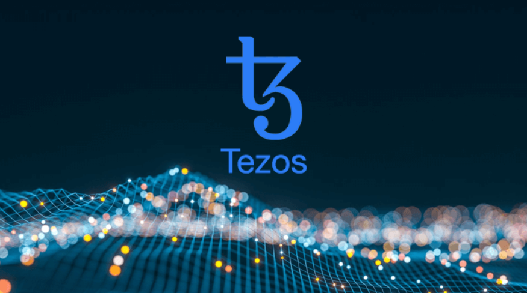

# Tezos

# Developing Tezos Smart Contracts w/Tezos

### Introduction
The SmartPy language is available through a Python library for building and analyzing Tezos smart contracts.
It comes with various tools: a compiler that generates Michelson code, a simulation engine, a contract explorer, etc

